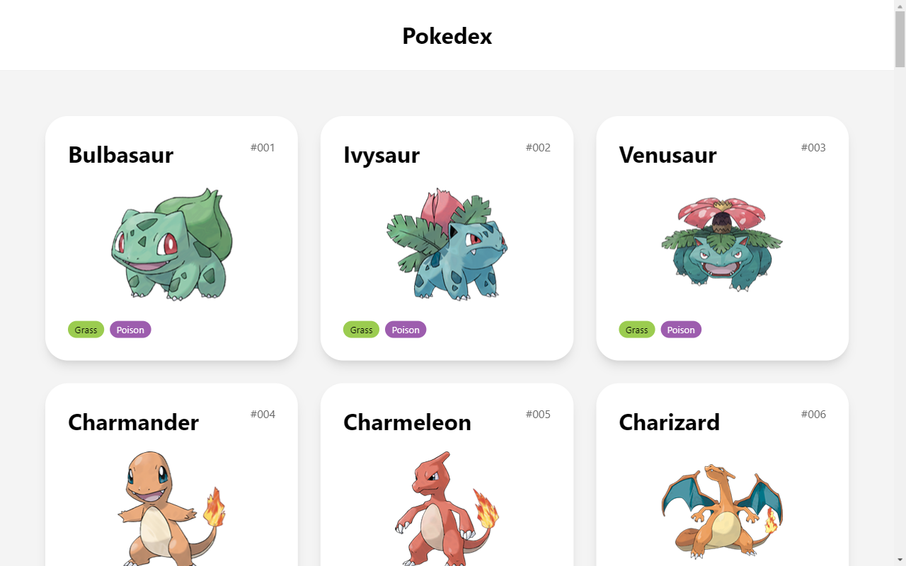
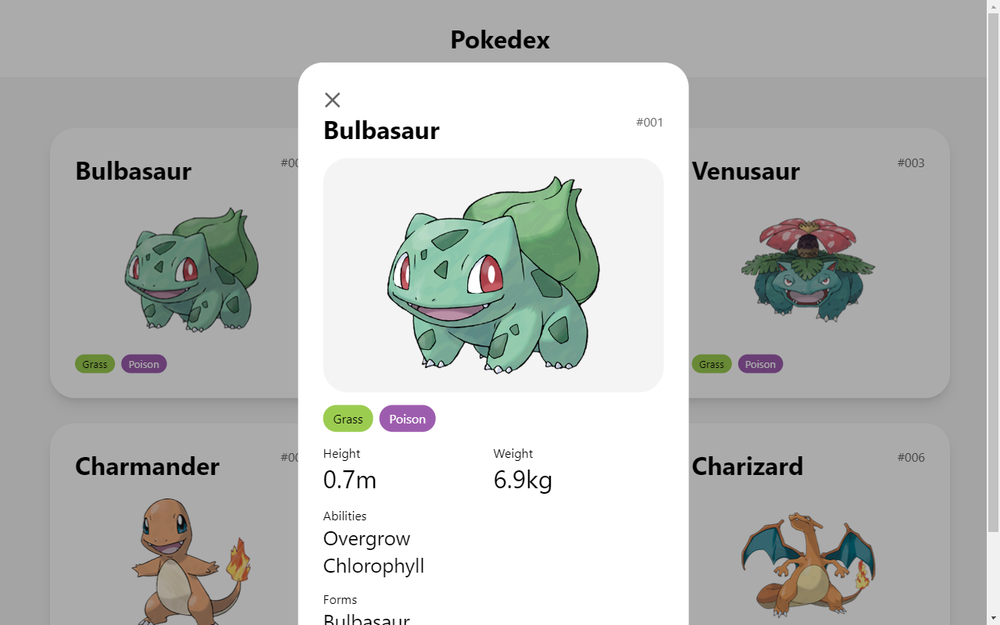
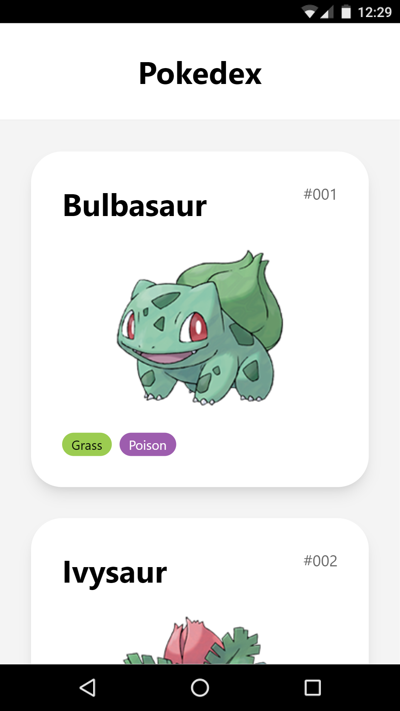
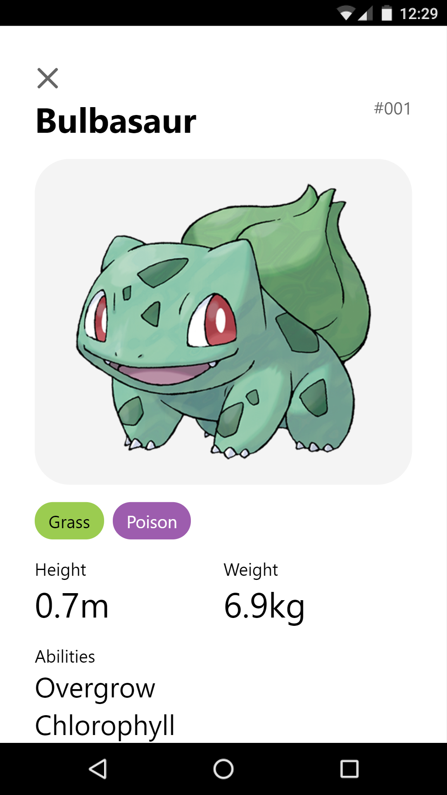

# Pokédex

Encyclopedia that provides various information on Pokémon

## Available Scripts

In the project directory, you can run:

### `npm start`

Runs the app in the development mode. 
Open [http://localhost:3000](http://localhost:3000) to view it in the browser.

### `npm test`

Launches the test runner.

## Desktop Images

## Mobile Images

